# Java Web安全-代码审计


@Author [安百科技](http://www.anbai.com)-[凌天实验室](http://www.absec.cn)-[园长](http://javaweb.org)

@Email admin@javaweb.org

@Date 2018-12-29

@Github [javaweb-codereview](https://github.com/anbai-inc/javaweb-codereview)

## 一、JavaWeb安全基础

### 1. 何为代码审计?

通俗的说Java代码审计就是通过审计Java代码来发现Java应用程序自身中存在的安全问题，由于Java本身是编译型语言，所以即便只有class文件的情况下我们依然可以对Java代码进行审计。对于未编译的Java源代码文件我们可以直接阅读其源码，而对于已编译的class或者jar文件我们就需要进行反编译了。

Java代码审计其本身并无多大难度，只要熟练掌握审计流程和常见的漏洞审计技巧就可比较轻松的完成代码审计工作了。但是Java代码审计的方式绝不仅仅是使用某款审计工具扫描一下整个Java项目代码就可以完事了，一些业务逻辑和程序架构复杂的系统代码审计就非常需要审计者掌握一定的Java基础并具有具有一定的审计经验、技巧甚至是对Java架构有较深入的理解和实践才能更加深入的发现安全问题。

本文将分为多章节来讲述Java代码审计需要掌握的前置知识以及Java代码审计的流程、技巧。


### 2. 准备环境和辅助工具

在开始Java代码审计前请自行安装好Java开发环境，建议使用MacOS、Ubuntu操作系统。

所谓“工欲善其事，必先利其器”，合理的使用一些辅助工具可以极大的提供我们的代码审计的效率和质量！

强烈推荐下列辅助工具：

1. `Jetbrains IDEA(IDE)`
2. `Sublime text(文本编辑器)`
3. `JD-GUI(反编译)`
4. `Fernflower(反编译)`
5. `Bytecode-Viewer`
6. `Eclipse(IDE)`
7. `NetBeans(IDE)`


## 二、反编译技巧

在渗透测试的时候需要审计的代码通常是`class文件`或者`jar包`，那么我们应该如何审计呢？让我们先来学习一下什么是Java源码和字节码。

### 1. Java类编译与反编译基础

简单的说Java源码就是未经编译的`.java`文件，我们可以很轻松的阅读其中的代码逻辑，而字节码`.class`文件则是`.java`文件经过编译之后产生的字节码文件，因为`.class`文件是编译后的二进制文件所以我们是无法直接阅读的，只能通过反编译工具将二进制文件转换成`java代码`或者`ASM代码`。

**示例代码Test.java:**

```
/**
 * @author yz
 */
public class Test {

	public static void hello() {
		System.out.println("Hello~");
	}

	public void world() {
		System.out.println("World!");
	}

	public static void main(String[] args) {
		hello();
	}

}
```

**Test.java编译执行流程:**


**Test.java 源码、字节码**


由于class文件的可读性较差，通常我们需要使用Java反编译工具来反编译代码。我们通常会使用到[JD-GUI](http://jd.benow.ca/)、[IDEA Fernflower插件](https://github.com/JetBrains/intellij-community/tree/master/plugins/java-decompiler/engine/src/org/jetbrains/java/decompiler)、[Bytecode-Viewer](https://github.com/Konloch/bytecode-viewer/releases)、[Fernflower](https://the.bytecode.club/showthread.php?tid=5)、[JAD](http://www.javadecompilers.com/jad)、[JBE](http://www.cs.ioc.ee/~ando/jbe/)、[JEB](https://www.pnfsoftware.com/jeb/manual/) 等工具来反编译class。

其中`JD-GUI`可能是目前反编译中使用的最多的工具了，但是个人觉得`JD-GUI`的反编译能力远不如经过`IDEA`(IDEA应该是使用的改版后的`Fernflower`)，因为`IDEA`默认支持对`jar`和`class`的反编译，所以我个人强烈推荐使用`IDEA`来反编译class代码。

当然，反编译工具很多时候也不是万能的，`JD-GUI`经常遇到无法反编译或反编译过程中程序直接崩溃的情况，遇到这类情况我们通常可以使用`IDEA`反编译试试，如果`IDEA`也无法反编译可以使用`JBE`来加载`class文件`读取程序的字节码，如果`JBE`仍无法读取类信息还可以使用`JDK`自带的`javap命令`来读取`class类字节码`，如果上诉所有的方法都无法反编译，那么恐怕是这个类本身就存在无法编译问题要么可能就是类文件被加密处理过。可能你会说java编译的class不是说不可以加密吗？没错，这里所说的加密其实是为了保护编译后的class代码不可反编译，通过实现`自定义ClassLoader`来`loadClass`加密后的类方式而已,这种加密方式曾在实战中也有遇到。

### 2. 反编译整个Jar技巧
 
通常我们在某些特殊的场景下拿到的只是jar文件，那么我们应该如何反编译整个jar包的class文件呢？

#### 2.1. Fernflower

Fernflower可以很轻松的实现jar的完整反编译，执行如下命令即可：
`java -jar fernflower.jar jarToDecompile.jar decomp/`
其中`jarToDecompile.jar`是需要反编译的jar文件，`decomp`是反编译后的`class文件`所存放的目录。需要注意的是`Fernflower`如遇无法反编译的情况可能会生成空的java文件！

#### 2.2. JD-GUI

`JD-GUI`是一个带GUI的反编译工具，在`JD-GUI`的菜单中点击`File`-->`Save All Sources`即可反编译jar。

#### 2.3. IDEA

IDEA默认就支持jar包反编译，同时还支持class文件名(`⇧⌘F`)、类方法名称(`⇧⌘O`)搜索。

#### 2.4. Bytecode-Viewer

`FernFlower`提供了GUI版本[Bytecode-Viewer](https://github.com/Konloch/bytecode-viewer/releases),`Bytecode-Viewer`提供了直接反编译的`class`、`jar`、`zip`、`apk`、`dex`功能，直接拖拽jar就可以直接对整个jar进行反编译了。


#### 2.5. Find命令

`find`命令并不能支持Java反编译，但是`find`命令可以非常方便的搜索经过编译后的二进制文件中的内容,所以有的时候使用`find`命令通常是最简单实用的，直接解压jar包然后使用find命令搜索: `find ./ -type f -name “*.class” |xargs grep XXXX` 即可搞定。

#### 2.6 使用Find命令和Fernflower实现批量反编译jar

当我们只有项目war包且源码经过打包后发布到`WEB-INF/lib`的情况下，我们不得不去找出待审计源码的具体jar文件并反编译。遇到这种情况我们可以巧妙的使用`find`命令来反编译所有目标的jar包。

这里以`jcms`的一个非常老版本为例,`jcms`最终给客户部署的war包中源码并不是在`WEB-INF/classes`目录下，而是将整个`jcms`系统按模块打包成了多个jar包放在了`WEB-INF/lib`目录下。我们可以通过搜索`com.hanweb`包名称来找出所有jar中包含了`jcms`的文件并通过`Fernflower`来反编译。

```
java -jar /Users/yz/Desktop/javaweb-decomplier/javaweb-decomplier.jar -dgs=1 $(find /Users/yz/Desktop/jcms/WEB-INF/lib/ -type f -name "*.jar" |xargs grep "com.hanweb" |awk '{print $3}') /Users/yz/jcms-decomplier
```

执行上面的命令后会在`jcms-decomplier`目录下看到所有的jar已经被`Fernflower`反编译了。


依赖的jar: [javaweb-decomplier](https://github.com/anbai-inc/javaweb-decomplier)、[Intellij java-decompiler]( https://github.com/JetBrains/intellij-community/tree/master/plugins/java-decompiler/engine)。


### 3. IntelliJ IDEA 推荐

`IntelliJ IDEA`是`Jetbrains`出品的一款非常强大的`Java IDE`，IDEA提供了强大的代码搜索、近乎完美的反编译、动态调试等功能可以最大程度的辅助我们代码审计。

不可以否认，与IDEA相比虽然Eclipse和Netbeans也有与之类似的功能，但是在真正的实战体验中个人更倾向于使用IDEA，虽然曾经的我也是一个重度Eclipse开发者。

## 三、IDEA代码搜索技巧

IDEA的搜索快捷键是:`⇧⌘F`,使用IDEA提供的搜索功能可以非常快速的定位漏洞点信息。


IDEA可以通过自定义搜索范围来精确查找我们需要审计的代码。默认搜索的是所有的位置，不过我们可以点击红色箭头指向的`...`按钮来细化我们的搜索范围。

### 1. 自定义范围搜索


**自定义搜索范围示例:**


自定义搜索范围后就可以在搜索时使用自定义的配置进行范围搜索了，有助于我们在挖漏洞的时候缩小代码定位范围。


### 2. 标记搜索

搜索快捷键: `⌘O`，标记搜索支持`类名`、`方法名`搜索（`包括class或jar文件`中的方法也支持搜索）。


### 3. Java调用链搜索

当我们审计代码的时候发现某个方法或类有漏洞时我们需要定位到漏洞的请求地址(触发点)，复杂业务系统往往会让我们很难定位到漏洞的触发点。借助IDEA的方法调用链搜索功能就可以很轻松的找出方法的调用链和触发点。 

选择`类或者方法名`-->`右键`-->`Find Useages`或者使用快捷键`⌥F7`


## 四、Java Web基础

### 1. Java分层思想

为了更好的管理项目我们通常会采用分层架构的方式来开发Java Web项目，分层设计的好处在于可以非常方便的分清楚包之间的业务逻辑关系。

**常见的JavaWeb项目分层：**

```
视图层（View 视图)
控制层（Controller、Action 控制层）
服务层（Service）
业务逻辑层BO(business object)  
实体层（entity 实体对象、VO(value object) 值对象 、模型层（bean）。
持久层（dao- Data Access Object 数据访问层、PO(persistant object) 持久对象）
```

**基于Java分层架构的示例项目:**


### 2. Java模块化开发 

如今的较为大型的`Java Web`项目通常都采用了模块化方式开发，借助于`Maven`、`Gradle`依赖管理工具，Java可以非常轻松的完成模块化开发。除此之外使用`OSGi`(`Open Service Gateway Initiative` 可实现模块热部署)技术开发来Java动态模块化系统也是较为常见的。

采用模块化开发也会给我们做代码审计带来一定的难度，因为需要在更多的依赖库中去寻找需要我们审计的代码。

**使用Maven开发的JavaWeb项目示例:**


### 3. 什么是Servlet?

`Servlet`是在`Java Web容器`上运行的`小程序`,通常我们用`Servlet`来处理一些较为复杂的服务器端的业务逻辑。值得注意的是在`Servlet3.0`之后(`Tomcat7+`)可以使用注解方式配置`Servlet`了。

**基于注解的Servlet**


	
`Servlet3.0`之前的版本都需要在`web.xml`中配置，`Servlet`是`两对标签`，由`<servlet>`和`<servlet-mapping>`组成，`Spring MVC`框架就是`基于Servlet技术`实现的。

**基于配置实现的Servlet**


**HttpServlet类**


实现一个`Servlet`很简单，只需要继承`javax.servlet.http.HttpServlet`类并重写`doXXX`方法或者`service`方法就可以了，其中需要注意的是重写`HttpServlet`类的`service`方法可以获取到上述七种Http请求方法的请求。

### 4. JSP、Servlet之间的关系

JSP、JSPX文件是可以直接被Java容器直接解析的动态脚本，jsp和其他脚本语言无异，不但可以用于页面数据展示，也可以用来处理后端业务逻辑。

从本质上说JSP就是一个Servlet，因为jsp文件最终会被编译成class文件，而这个Class文件实际上就是一个特殊的Servlet。

JSP文件会被编译成一个java类文件，如`index.jsp`在Tomcat中`Jasper`编译后会生成`index_jsp.java`和`index_jsp.class`两个文件。而index_jsp.java 继承于`HttpJspBase`类，`HttpJspBase`是一个实现了`HttpJspPage`接口并继承了`HttpServlet`的标准的`Servlet`，`__jspService`方法其实是`HttpJspPage`接口方法，类似于`Servlet`中的`service`方法，这里的`__jspService`方法其实就是`HttpJspBase`的`service`方法调用。


### 5. 什么是Filter

Filter是JavaWeb中的过滤器,用于过滤URL请求。通过Filter我们可以实现URL请求资源权限验证、用户登陆检测等功能。Filter是一个接口，实现一个Filter只需要重写`init`、`doFilter`、`destroy`方法即可，其中过滤逻辑都在`doFilter`方法中实现。

Filter和Servlet一样是Java Web中最为核心的部分，使用Servlet和Filter可以实现后端接口开发和权限控制，当然使用Filter机制也可以实现MVC框架，`Struts2`实现机制就是使用的Filter。

Filter的配置类似于Servlet，由`<filter>`和`<filter-mapping>`两组标签组成，如果Servlet版本大于3.0同样可以使用注解的方式配置Filter。


### 6. Filter和Servlet的总结

对于基于`Filter`和`Servlet`实现的简单架构项目，代码审计的重心集中于找出所有的`Filter`分析其过滤规则，找出是否有做全局的安全过滤、敏感的URL地址是否有做权限校验并尝试绕过`Filter`过滤。第二点则是找出所有的`Servlet`，分析`Servlet`的业务是否存在安全问题,如果存在安全问题是否可以利用？是否有权限访问？利用时是否被Filter过滤等问题，切勿看到`Servlet`、`JSP`中的漏洞点就妄下定论，不要忘了`Servlet`前面很有可能存在一个全局安全过滤的`Filter`。

`Filter`和`Servlet`都是`Java Web`提供的API，简单的总结了下有如下共同点。

1. `Filter`和`Servlet`都需要在`web.xml`或`注解`(`@WebFilter`、`@WebServlet`)中配置，而且配置方式是非常的相似的。
2. `Filter`和`Servlet`都可以处理来自Http请求的请求，两者都有`request`、`response`对象。
3. `Filter`和`Servlet`基础概念不一样，`Servlet`定义是容器端小程序，用于直接处理后端业务逻辑，而`Filter`的思想则是实现对Java Web请求资源的拦截过滤。
4. `Filter`和`Servlet`虽然概念上不太一样，但都可以处理Http请求，都可以用来实现MVC控制器(`Struts2`和`Spring`框架分别基于`Filter`和`Servlet`技术实现的)。
5. 一般来说`Filter`通常配置在`MVC`、`Servlet`和`JSP`请求前面，常用于后端权限控制、统一的Http请求参数过滤(`统一的XSS`、`SQL注入`、`Struts2命令执行`等攻击检测处理)处理，其核心主要体现在请求过滤上，而`Servlet`更多的是用来处理后端业务请求上。


### 7. 初识JavaWeb MVC框架

传统的开发存在结构混乱易用性差耦合度高可维护性差等多种问题，为了解决这些毛病分层思想和MVC框架就出现了。`MVC`即模型(`Model`)、视图(`View`)、控制器(`Controller`)， MVC模式的目的就是实现Web系统的职能分工。

截至2018年底，绝大多数的新项目都已然改为了基于`Spring Boot`的`Spring MVC`实现，也就是说曾经站在JavaWeb MVC最巅峰的`Struts2`框架已经逐渐陨落。

#### 7.1 Spring MVC 控制器

在Spring进入了3.0时代,使用Java注解的方式也逐渐的流行了起来，曾经写一个Spring的控制器我们通常要在xml中声明Spring bean并配置处理的URL，而在新时代的Spring项目中我们通常用`Spring MVC注解`就可以轻松完成`Spring MVC`的配置了。

**一个基于Spring 注解配置的控制器:**

```
package org.javaweb.codereview.controller;

import org.springframework.stereotype.Controller;
import org.springframework.web.bind.annotation.GetMapping;

@Controller
public class IndexController {

	@RequestMapping("/index.php")
	public String index() {
		return "/index.html";
	}

}
```

**Spring Controller注解:**

1. [@Controller](https://docs.spring.io/spring/docs/5.1.3.RELEASE/javadoc-api/org/springframework/stereotype/Controller.html)
2. [@RestController](https://docs.spring.io/spring/docs/5.1.3.RELEASE/javadoc-api/org/springframework/web/bind/annotation/RestController.html)
3. [@RepositoryRestController](https://docs.spring.io/spring-data/rest/docs/current/reference/html/)

**`Spring MVC`请求配置注解:**

1. [@RequestMapping](https://docs.spring.io/spring/docs/5.1.3.RELEASE/javadoc-api/org/springframework/web/bind/annotation/RequestMapping.html)
2. [@GetMapping](https://docs.spring.io/spring/docs/5.1.3.RELEASE/javadoc-api/org/springframework/web/bind/annotation/GetMapping.html)
3. [@PostMapping](https://docs.spring.io/spring/docs/5.1.3.RELEASE/javadoc-api/org/springframework/web/bind/annotation/PostMapping.html)
4. [@PutMapping](https://docs.spring.io/spring/docs/5.1.3.RELEASE/javadoc-api/org/springframework/web/bind/annotation/PutMapping.html)
5. [@DeleteMapping](https://docs.spring.io/spring/docs/5.1.3.RELEASE/javadoc-api/org/springframework/web/bind/annotation/DeleteMapping.html)
6. [@PatchMapping](https://docs.spring.io/spring/docs/5.1.3.RELEASE/javadoc-api/org/springframework/web/bind/annotation/PatchMapping.html)

Spring MVC除了上述6种Http请求处理注解以外还有Spring Data JPA Rest提供的特殊的[@RepositoryRestResource](https://docs.spring.io/spring-data/rest/docs/current/reference/html/)注解，`@RepositoryRestResource`是基于`Spring Data JPA REST`库实现的，`Spring Data JPA REST`提供的API可支持通过JPA查询数据并处理Http请求服务。

**基于XML配置的Spring MVC**

对于一些老旧的项目可能还保留了一些基于xml配置的方式Spring MVC项目，这里只简单的介绍下如何配置不做过多的描述。基于配置方式的控制器一般是在Controller类中实现了Spring的`org.springframework.web.servlet.mvc.Controller`接口的`handleRequest`方法(当然还有其他途径，如:`AbstractCommandController`和`SimpleFormController`但都已经过时了)。

**TestController.java示例代码:**

```
package org.javaweb.codereview.controller;

import org.springframework.web.servlet.ModelAndView;
import org.springframework.web.servlet.mvc.Controller;

import javax.servlet.http.HttpServletRequest;
import javax.servlet.http.HttpServletResponse;

/**
 * @author yz
 */
public class TestController implements Controller {

	@Override
	public ModelAndView handleRequest(HttpServletRequest request, HttpServletResponse response) throws Exception {
		ModelAndView mv = new ModelAndView();
		mv.setViewName("index");

		return mv;
	}

}
```

**XML配置具体的bean**

```
<bean name="/test.do" class="org.javaweb.codereview.controller.TestController"/>
```

#### 7.2 Struts2控制器

Struts2主要的开发模式是基于xml配置，在`struts.xml`中配置Action地址和对应的处理类。

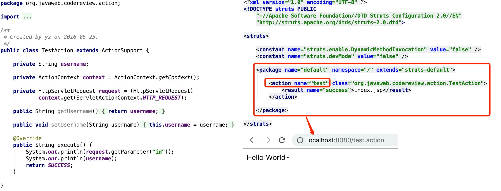

不过Struts2(`2.1.6`版本开始)也可以使用`struts2-convention-plugin`插件来实现基于注解方式的配置。

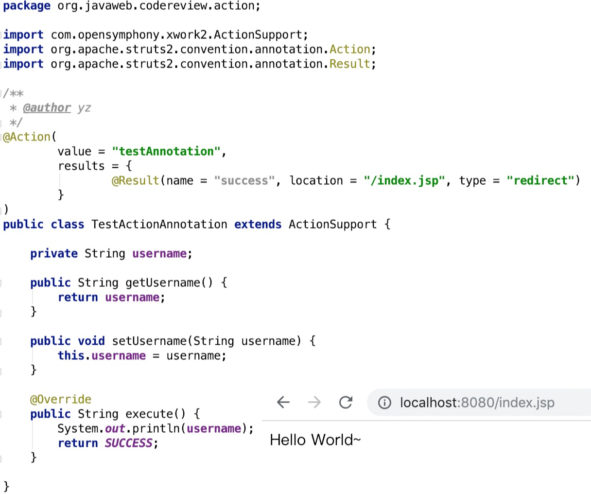

需要注意的是Struts2的参数是可以通过get/set方法传入的，如上图`TestActionAnnotation`类的`username`变量是可以直接在Http请求中的URL传入的。


#### 7.3 快速找出Http请求请求URL

代码审计中我们可以选择优先从`Controller`、`Servlet`和`JSP`中入手，也可以选择从漏洞点反向推出Http请求的入口地址，这里将讲解下如何快速找到这些请求入口，因为`Struts2`和`Spring MVC`的原理比较接近，所以本节只以`Spring MVC`为例。

##### 7.3.1 查找Spring MVC所有的控制器

如果有源码的情况下可以使用find命令或者IDEA的全局搜索功能即可快速搜索到所有的控制器，如果只有class文件的情况下可以使用find命令:

```
find ~/cms/ -type f -name "*.class" |xargs grep -E "Controller|@RestController|RepositoryRestController"
```

##### 7.3.2 查找所有的请求处理URL

查找请求处理URL的方式同理，使用如下find命令查找所有class中的请求处理注解:

```
find ~/cms/ -type f -name "*.class" |xargs grep -E "RequestMapping|GetMapping|PostMapping|PutMapping|DeleteMapping|PatchMapping|RepositoryRestResource"
```

#### 7.4 Spring MVC和Struts2控制器小结

这一小节我们只是简单的介绍下`Spring MVC`和`Struts2`的控制器，在后面的框架服务章节将会详细介绍。至于如何去快速定位Struts2的action请自行参考Spring MVC的Controller查找方式这里不再讲解。

## 五、Java语言的动态性

Java语言动态性一直以来都比较差，并不像PHP那样灵活。在Java中的动态性往往需要使用一些曲折的方式来实现.这里简单列举了Java十余种动态性相关技术并总结部分技术实现安全问题。

1. **Java反射机制**
2. **MethodHandle**
3. JDK动态代理
4. 使用JVM上的动态语言(如:`Groovy`、`JRuby`、`Jython`)
5. 表达式库(如:`OGNL`、`MVEL`、`SpEL`、`EL`)
6. **`JSP`、`JSPX`、`Quercus`(Resin容器提供了PHP5支持)**
7. 字节码库(如:`Asm`、`Javassist`、`Cglib`、`BCEL`)
8. ScriptEngineManager(脚本引擎)。
9. 动态编译(如:JDT、JavaCompiler)
10. **`ClassLoader`、`URLClassLoader`**
11. **模版引擎(如:`Freemarker`、`Velocity`)**
12. **序列化、反序列化(包含`Java 对象序列化`、`XML`、`JSON`等)**
13. `JNI`、`JNA`(Java调用C/C++)
14. `OSGi`(`Open Service Gateway Initiative`)
15. **RMI(Java远程方法调用,基于对象序列化机制实现)**
16. `WebService`
17. **`JDWP`(`Java Platform Debugger Architecture` Java调试协议)**
18. JMX(Java Management Extensions)

### 1. Java反射机制特性

Java反射机制可以无视类方法、变量访问权限修饰符，可以`调用任何类的任意方法、访问并修改成员变量值`。也就是说只要发现一处Java反射调用漏洞几乎就可以为所欲为了。当然前提可能需要你能`控制反射的类名、方法名和参数`。

一行代码即可实现反射调用Runtime执行本地命令:

```
Runtime.class.getMethod("exec", String.class).invoke(Runtime.class.getMethod("getRuntime").invoke(null), "whoami")
```

获取一个类的对象(如Runtime类)我们一般会采用如下几种方式:

1. `Class.forName("java.lang.Runtime")、"".getClass().forName("java.lang.Runtime")`
2. `Runtime.class`
3. `ClassLoader.getSystemClassLoader().loadClass("java.lang.Runtime")`

**Java反射获取类方法有两种方式:**

1. `getMethod(xxx)`,`getMethods()`
2. `getDeclaredMethod(xxx)`、`getDeclaredMethods()`。

区别在于`getMethod会返回当前类和父类的所有public方法`，而`getDeclaredMethod返回的是当前的所有方法`。

**Java反射获取类成员变量有两种方式:**

1. `getField(xxx)`、`getFields()`
2. `getDeclaredField(xxx)`、`getDeclaredFields()`

`getField`和`getDeclaredField`区别同上，如果想要`调用private修饰的Field或者Method`只需要设置下`setAccessible为true`就可以了，如:`xxxMethod.setAccessible(true)`。

Java的大部分框架都是采用了反射机制来实现的(如:`Spring MVC`、`ORM框架`等)，所以我们不得不掌握Java反射机制来提升我们的代码审计能力。

**Java反射机制实现无关键字执行命令**

```
import java.io.InputStream;
import java.lang.reflect.Method;
import java.util.Scanner;

/**
 * @author yz
 */
public class ReflectionTest {

	public static void exec() {
		try {
			System.out.println(Runtime.class.getMethod("exec", String.class).invoke(Runtime.class.getMethod("getRuntime").invoke(null), "curl -i localhost:8000"));
		} catch (Exception e) {
			e.printStackTrace();
		}
	}

	public static void main(String[] args) {
		try {
			String str = "whoami";

			// java.lang.Runtime
			String runtime = new String(new byte[]{106, 97, 118, 97, 46, 108, 97, 110, 103, 46, 82, 117, 110, 116, 105, 109, 101});

			// Runtime.class
			Class<?> c = Class.forName(runtime);

			// 获取getRuntime方法，Runtime.getRuntime()
			Method m1 = c.getMethod(new String(new byte[]{103, 101, 116, 82, 117, 110, 116, 105, 109, 101}));

			// 获取Runtime的exec方法，rt.exec(xxx)
			Method m2 = c.getMethod(new String(new byte[]{101, 120, 101, 99}), String.class);

			// Runtime.getRuntime().exec(str)
			Object obj2 = m2.invoke(m1.invoke(null), str);

			// 获取命令执行结果Process类的getInputStream()方法
			Method m = obj2.getClass().getMethod(new String(new byte[]{103, 101, 116, 73, 110, 112, 117, 116, 83, 116, 114, 101, 97, 109}));
			m.setAccessible(true);

			// process.getInputStream()
			InputStream in = (InputStream) m.invoke(obj2, new Object[]{});

			// 输出InputStream内容到
			Scanner scanner = new Scanner(in).useDelimiter("\\A");
			System.out.println(scanner.hasNext() ? scanner.next() : "");
		} catch (Throwable t) {
			t.printStackTrace();
		}
	}

}
```

### 2. JDK7+ MethodHandle

JDK7开始Java提供了`MethodHandle`可以非常方便的访问和调用类方法，`MethodHandle`的能力和Java反射机制相似，但效率却远高出Java反射机制，但`MethodHandle`也并不是那么完美的，缺点是`MethodHandle`必须要求JDK版本大于等于1.7，`MethodHandle`也无法像反射那样调用私有方法和变量。

参考:[通过代码简单介绍JDK 7的MethodHandle，并与.NET的委托对比](https://rednaxelafx.iteye.com/blog/477934)。

**基于MethodHandle实现的调用Runtime执行系统命令**

```
import java.io.InputStream;
import java.lang.invoke.MethodHandle;
import java.lang.invoke.MethodHandles;
import java.lang.invoke.MethodType;
import java.util.Scanner;

/**
 * @author yz
 */
public class MethodHandlesTest {

	public static void main(String[] args) {
		try {
			String               str          = "ping p2j.cn -c 1";
			Class                runtimeClass = Runtime.class;
			MethodHandles.Lookup lookup       = MethodHandles.lookup();

			// Runtime rt = Runtime.getRuntime()
			MethodHandle methodHandle = lookup.findStatic(
					runtimeClass, "getRuntime", MethodType.methodType(runtimeClass)
			);

			// 获取Runtime的exec方法
			MethodHandle execMethod = lookup.findVirtual(
					runtimeClass, "exec", MethodType.methodType(Process.class, new Class[]{
							String.class
					})
			);

			// 获取Process的getInputStream方法
			MethodHandle inputStreamMethod = lookup.findVirtual(
					Process.class, "getInputStream", MethodType.methodType(InputStream.class)
			);

			// 调用Runtime.getRuntime().exec(xxx).getInputStream()
			InputStream in = (InputStream) inputStreamMethod.invoke(
					execMethod.invoke(methodHandle.invoke(), str)
			);

			// 输出InputStream内容到
			Scanner scanner = new Scanner(in).useDelimiter("\\A");
			System.out.println(scanner.hasNext() ? scanner.next() : "");
		} catch (Throwable t) {
			t.printStackTrace();
		}
	}

}
```

## 六、Java代码审计-Checklist

通常我喜欢把代码审计的方向分为`业务层安全`问题、`代码实现`和`服务架构`安全问题,。

### 1. 业务层安全常见问题

业务层的安全问题集中在`业务逻辑`和`越权`问题上，我们在代码审计的过程中尽可能的去理解系统的业务流程以便于发现隐藏在业务中的安全问题。

### 1.1 业务层中常见的安全问题Checklist

1. 用户登陆、用户注册、找回密码等功能中密码信息未采用加密算法。
2. 用户登陆、用户注册、找回密码等功能中`未采用验证码`或`验证码未做安全刷新`(未刷新Session中验证码的值)导致的撞库、密码爆破漏洞。
3. 找回密码逻辑问题(如:可直接跳过验证逻辑直接发包修改)。
4. 手机、邮箱验证、找回密码等涉及到动态验证码等功能`未限制验证码失败次数`、`验证码有效期`、`验证码长度过短`导致的验证码爆破问题。
5. 充值、付款等功能调用了第三方支付系统未正确校验接口(如:1分钱买IPhone X)。
6. 后端采用了`ORM框架`更新操作时因处理不当导致可以更新用户表任意字段(如:用户注册、用户个人资料修改时可以`直接创建管理员账号`或其他越权修改操作)。
7. 后端采用了`ORM框架`查询数据时因处理不当导致可以接收任何参数导致的越权查询、敏感信息查询等安全问题。
8. 用户中心转账、修改个人资料、密码、退出登陆等功能未采用验证码或Token机制导致存在CSRF漏洞。
9. 后端服务过于信任前端，重要的参数和业务逻辑只做了前端验证(如:文件上传功能的文件类型只在JS中验证、后端不从Session中获取用户ID、用户名而是直接接收客户端请求的参数导致的越权问题)。
10. 用户身份信息认证逻辑问题(如:后台系统自动登陆时直接读取Cookie中的用户名、用户权限不做验证)。
11. 重要接口采用ID自增、ID可预测并且云端未验证参数有效性导致的越权访问、信息泄漏问题(如:任意用户订单越权访问)。
12. 条件竞争问题，某些关键业务(如:用户转账)不支持并发、分布式部署时不支持锁的操作等。
13. 重要接口未限制请求频率，导致短信、邮件、电话、私信等信息轰炸。
14. 敏感信息未保护，如Cookie中直接存储用户密码等重要信息。
15. 弱加密算法、弱密钥，如勿把Base64当成数据加密方式、重要算法密钥采用弱口令如`123456`。
16. 后端无异常处理机制、未自定义50X错误页面,服务器异常导致敏感信息泄漏(如:数据库信息、网站绝对路径等)。
17. 使用DWR框架开发时前后端不分漏洞(如:DWR直接调用数据库信息把用户登陆逻辑直接放到了前端来做)。

### 2. 代码实现常见问题

代码审计的核心是寻找代码中程序实现的安全问题，通常我们会把代码审计的重心放在SQL注入、文件上传、命令执行、任意文件读写等直接威胁到服务器安全的漏洞上，因为这一类的漏洞杀伤力极大也是最为致命的。

###2.1 代码实现中常见的安全问题Checklist

1. 任意`文件读写`(文件上传、文件下载)、`文件遍历`、`文件删除`、`文件重命名`等漏洞
2. SQL注入漏洞
3. XXE(XML实体注入攻击)
4. 表达式执行(SpEL、OGNL、MVEL2、EL等)
6. 系统命令执行漏洞(ProcessBuilder)
7. 反序列化攻击(ObjectInputStream、JSON、XML等)
8. Java反射攻击
9. SSRF攻击


#### 2.1.1 Java 文件名空字节截断漏洞(%00 Null Bytes)

空字节截断漏洞漏洞在诸多编程语言中都存在，究其根本是Java在调用文件系统(C实现)读写文件时导致的漏洞，并不是Java本身的安全问题。不过好在高版本的JDK在处理文件时已经把空字节文件名进行了安全检测处理。

2013年9月10日发布的`Java SE 7 Update 40`修复了空字节截断这个历史遗留问题。此次更新在`java.io.File`类中添加了一个isInvalid方法，专门检测文件名中是否包含了空字节。

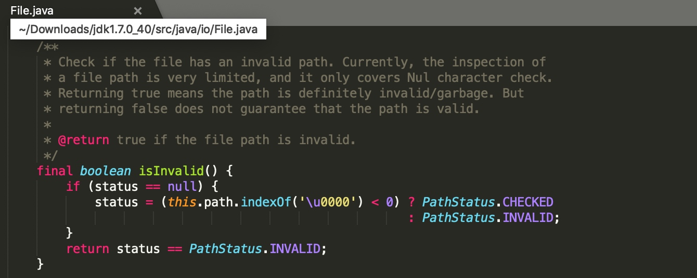

修复的JDK版本所有跟文件名相关的操作都调用了`isInvalid`方法检测，防止空字节截断。


修复前(`Java SE 7 Update 25`)和修复后(`Java SE 7 Update 40`)的对比会发现`Java SE 7 Update 25`中的`java.io.File`类中并未添加`\u0000`的检测。


受空字节截断影响的JDK版本范围:`JDK<1.7.40`,单是JDK7于2011年07月28日发布至2013年09月10日发表`Java SE 7 Update 40`这两年多期间受影响的就有16个版本，值得注意的是JDK1.6虽然JDK7修复之后发布了数十个版本，但是并没有任何一个版本修复过这个问题，而JDK8发布时间在JDK7修复以后所以并不受此漏洞影响。

参考:

1. [JDK-8014846 : File and other classes in java.io do not handle embedded nulls properly](https://bugs.java.com/bugdatabase/view_bug.do?bug_id=8014846)。
2. [维基百科-Java版本歷史](https://zh.wikipedia.org/wiki/Java版本歷史)
3. [Oracle Java 历史版本下载](https://www.oracle.com/technetwork/java/javase/archive-139210.html)

##### 2.1.2 测试Java写文件截断测试

测试类`FileNullBytes.java`:

```
import java.io.File;
import java.io.FileOutputStream;
import java.io.IOException;

/**
 * @author yz
 */
public class FileNullBytes {

	public static void main(String[] args) {
		try {
			String fileName = "/tmp/null-bytes.txt\u0000.jpg";
			FileOutputStream fos = new FileOutputStream(new File(fileName));
			fos.write("Test".getBytes());
			fos.flush();
			fos.close();
		} catch (IOException e) {
			e.printStackTrace();
		}
	}

}
```

使用`JDK1.7.0.25`测试成功截断文件名：


使用`JDK1.7.0.80`测试写文件截断时抛出`java.io.FileNotFoundException: Invalid file path`异常:


**空字节截断利用场景**

Java空字节截断利用场景最常见的利用场景就是`文件上传`时后端使用了`endWith`、正则使用如:`.(jpg|png|gif)$`验证文件名后缀且文件名最终原样保存,同理文件删除(`delete`)、获取文件路径(`getCanonicalPath`)、创建文件(`createNewFile`)、文件重命名(`renameTo`)等方法也可适用。

**空字节截断修复方案**

最简单直接的方式就是升级JDK，如果担心升级JDK出现兼容性问题可在文件操作时检测下文件名中是否包含空字节，如JDK的修复方式:`fileName.indexOf('\u0000')`即可。

#### 2.1.2 任意文件读取漏洞

任意文件读取漏洞即因为没有验证请求的资源文件是否合法导致的，此类漏洞在Java中有着较高的几率出现，任意文件读取漏洞看似很简单，但是在这个问题上翻车的有不乏一些知名的中间件:`Weblogic`、`Tomcat`、`Resin`又或者是主流MVC框架:`Spring MVC`、`Struts2`。所以在审计文件读取功能的时候要非常仔细，或许很容易就会有意想不到的收获！

**任意文件读取示例代码`file-read.jsp`:**

```
<%@ page contentType="text/html;charset=UTF-8" language="java" %>
<%@ page import="java.io.ByteArrayOutputStream" %>
<%@ page import="java.io.File" %>
<%@ page import="java.io.FileInputStream" %>

<%
    File file = new File(request.getParameter("path"));
    FileInputStream fis = new FileInputStream(file);
    ByteArrayOutputStream baos = new ByteArrayOutputStream();
    byte[] b = new byte[1024];
    int a = -1;

    while ((a = fis.read(b)) != -1) {
        baos.write(b, 0, a);
    }

    out.write("<pre>" + new String(baos.toByteArray()) + "</pre>");

    fis.close();
%>
```

访问`file-read.jsp`文件即可读取任意文件:`http://localhost:8080/file/file-read.jsp?path=/etc/passwd`

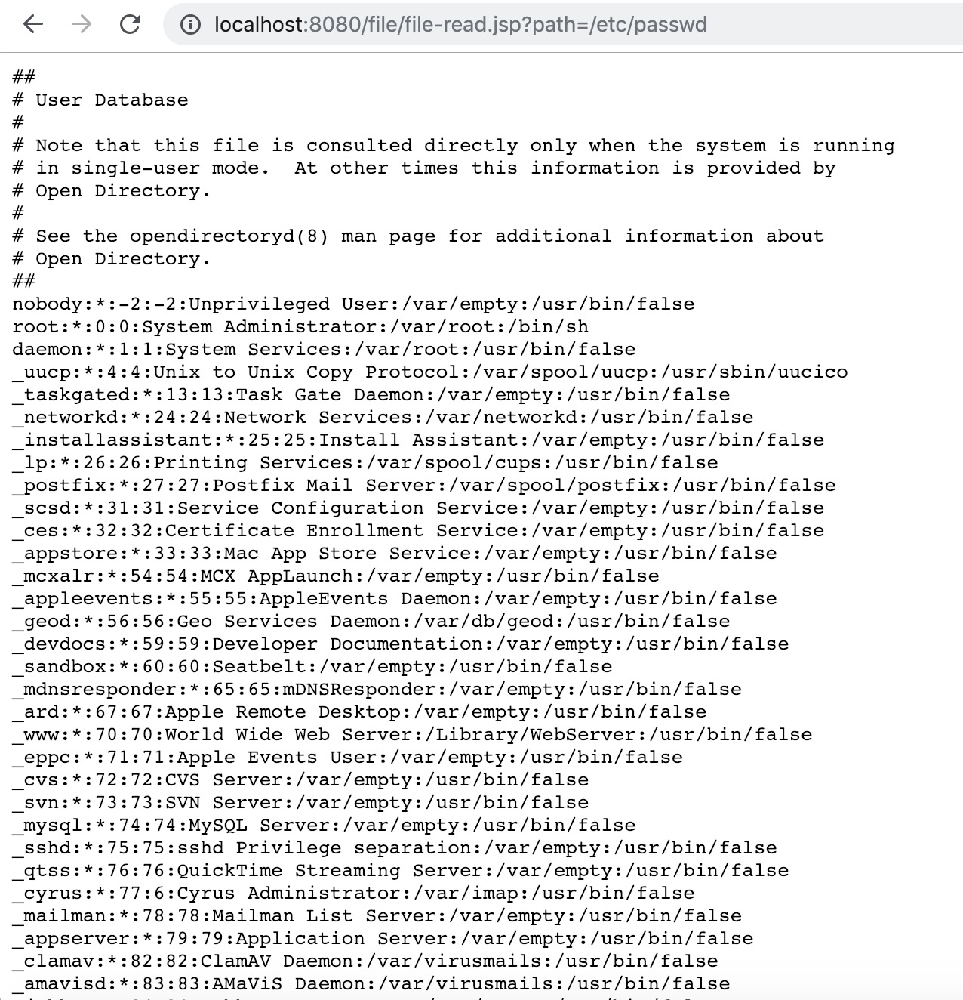

快速发现这类漏洞得方式其实也是非常简单的，在IDEA中的项目中重点搜下如下文件读取的类。

1. **JDK原始的`java.io.FileInputStream`类**
2. **JDK原始的`java.io.RandomAccessFile`类**
3. **Apache Commons IO提供的`org.apache.commons.io.FileUtils`类**
4. JDK1.7新增的基于NIO非阻塞异步读取文件的`java.nio.channels.AsynchronousFileChannel`类。
5. JDK1.7新增的基于NIO读取文件的`java.nio.file.Files`类。常用方法如:`Files.readAllBytes`、`Files.readAllLines`

如果仍没有什么发现可以搜索一下FileUtil很有可能用户会封装文件操作的工具类。

### Java WebSevice

`Web Service`是一种基于`SOAP协议`实现的跨语言Web服务调用，在Java中`Web Service`有如下技术实现:`Oracle JWS`、`Apache Axis1、2`、`XFire`、`Apache CXF`、`JBossWS`。

#### Axis1.4 配置

`web.xml`配置`Axis1.4`

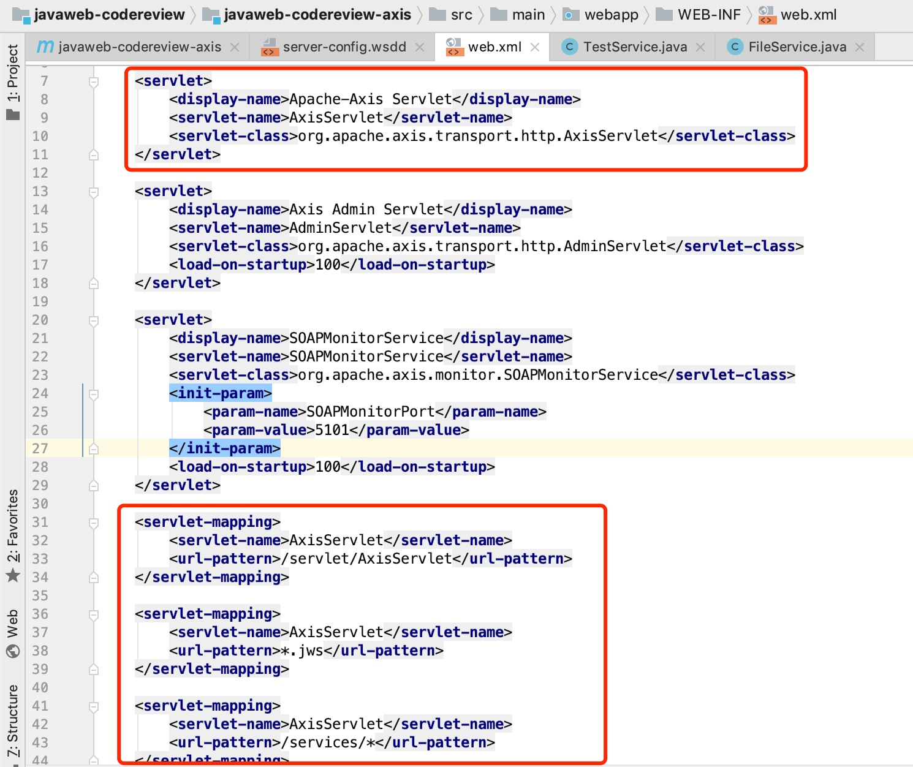

配置`server-config.wsdd`文件注册`Web Service`服务类和方法:

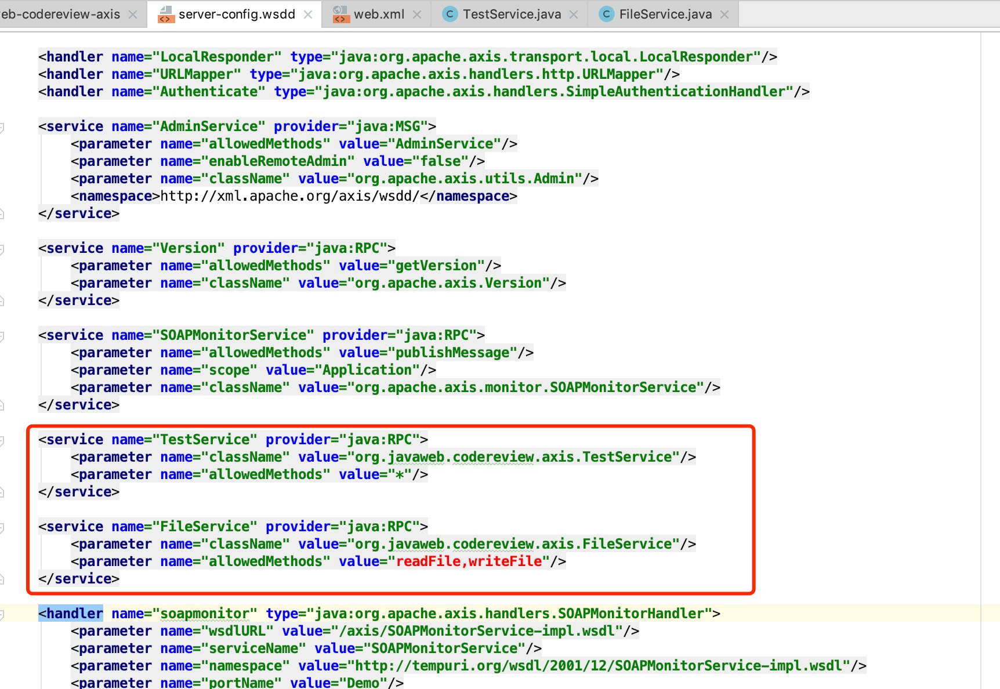

`FileService`类，提供了文件读写接口:

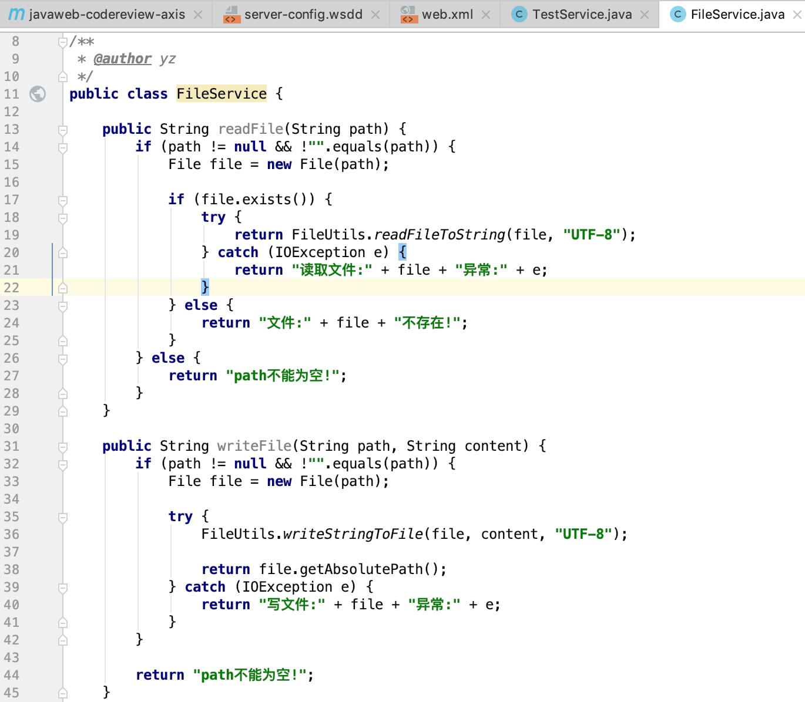

使用IDEA创建`Web Service`项目默认会创建管理`Web Service`的API:`/servlet/AxisServlet`、`/services`、`SOAPMonitor`、`/servlet/AdminServlet`，`*.jws`以及用监控`Web Service`的端口`5001`或`5101`。

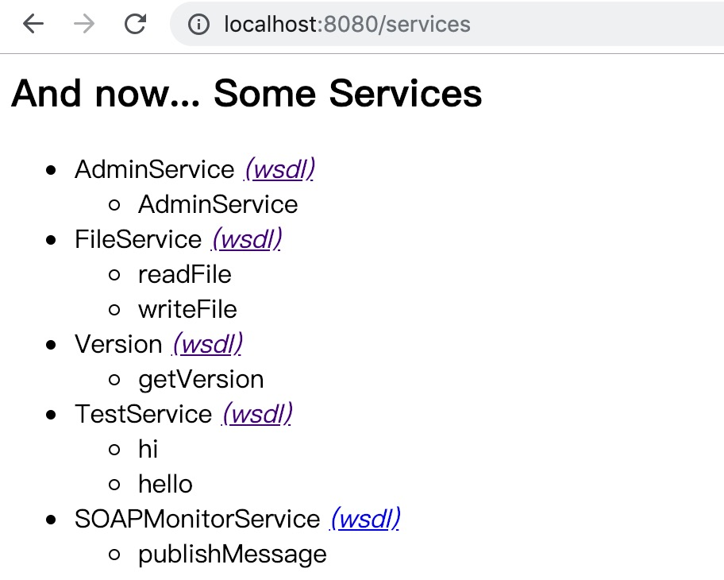


访问`Web Service`的`FileService`服务加上`?wsdl`参数可以看到`FileService`提供的服务方法和具体的参数信息。

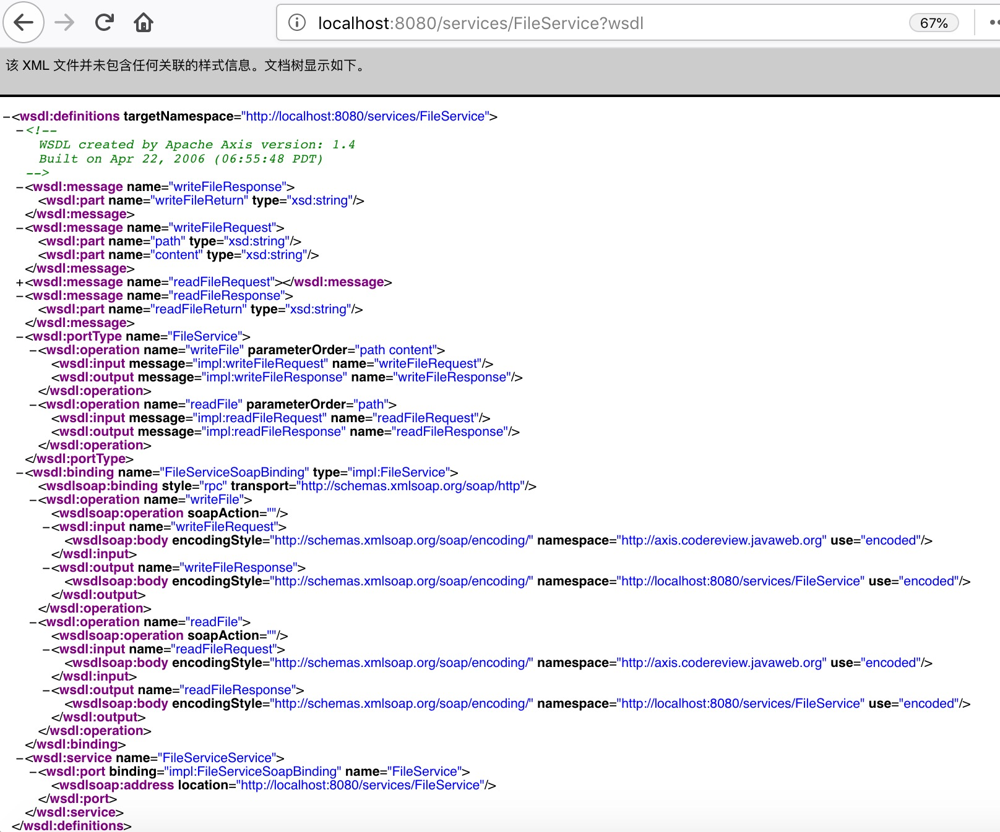

使用SOAP-UI调用`Web Service`接口示例:


需要注意的是`Web Service`也是可以设置授权认证的,如实现了`WS-Security`的`WSS4J`。


使用IDEA根据wsdl生成`Web Service`客户端代码：

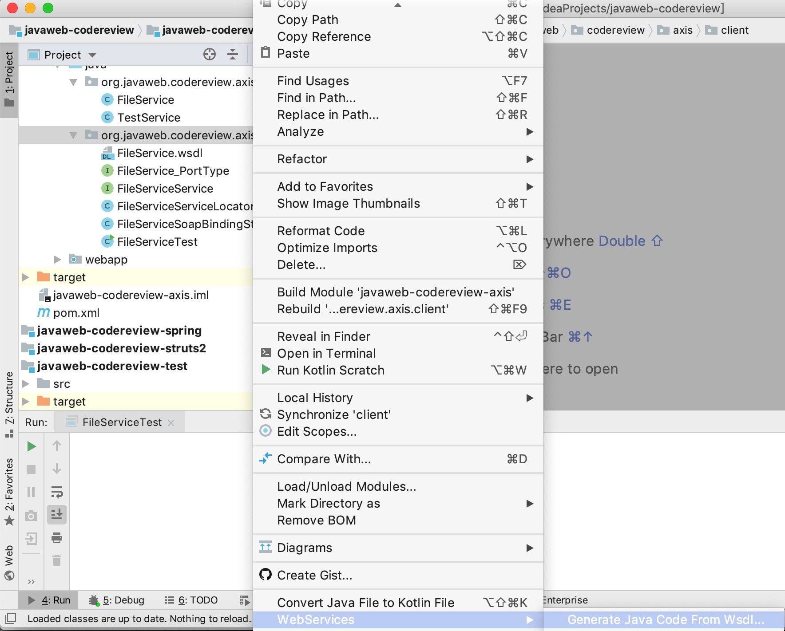

设置wsdl地址、包名:

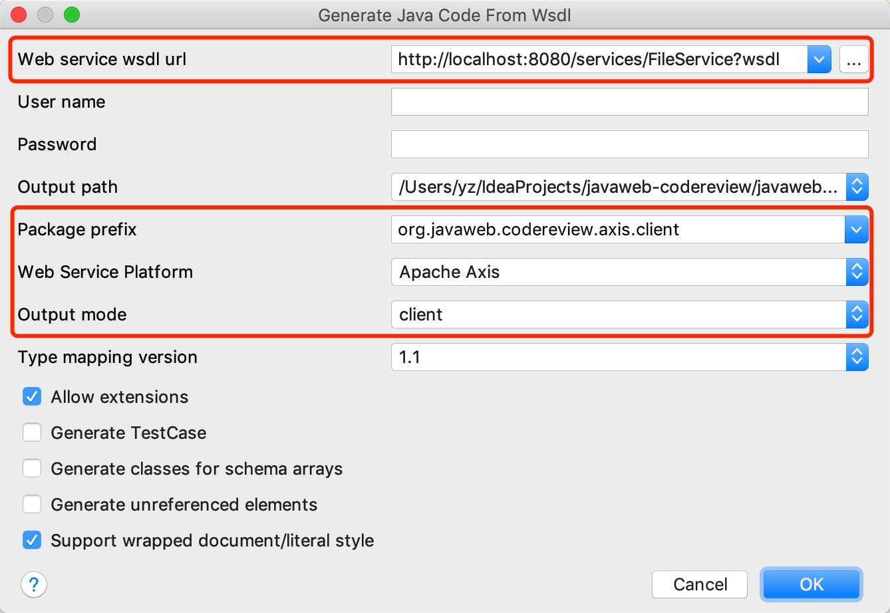

新建`FileServiceTest`类测试接口调用:

```
package org.javaweb.codereview.axis.client;

import java.net.URL;

/**
 * 文件Web Service服务测试
 *
 * @author yz
 */
public class FileServiceTest {

	public static void main(String[] args) {
		try {
			FileServiceService         fileService   = new FileServiceServiceLocator();
			URL                        webServiceUrl = new URL("http://localhost:8080/services/FileService");
			FileServiceSoapBindingStub soapService   = new FileServiceSoapBindingStub(webServiceUrl, fileService);

			String content = soapService.readFile("/etc/passwd");

			System.out.println(content);
		} catch (Exception e) {
			e.printStackTrace();
		}
	}

}
```

参考:

1. [Axis1.4框架 实现webservice服务器和客户端](https://www.cnblogs.com/dls-java/p/5038128.html)
2. [使用IDEA根据wsdl生成WebServices客户端代码-Java](https://blog.csdn.net/vfsdfdsf/article/details/80426276)
3. [axis2 利用小工具cat.aar](http://javaweb.org/?p=1548)
